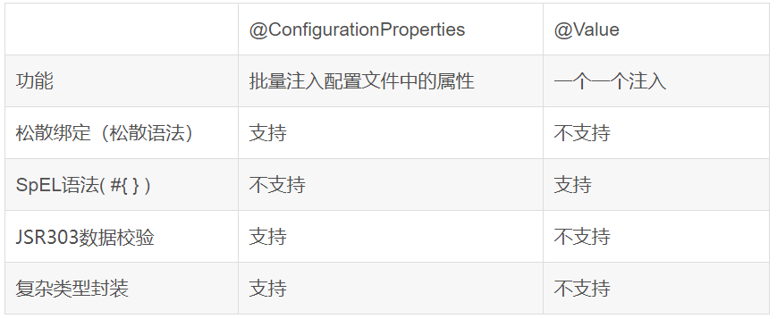
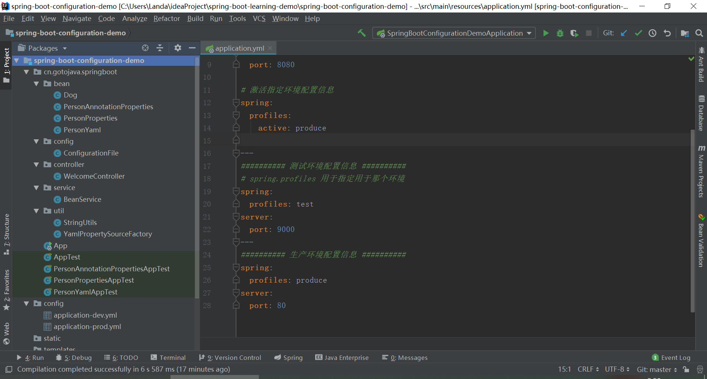
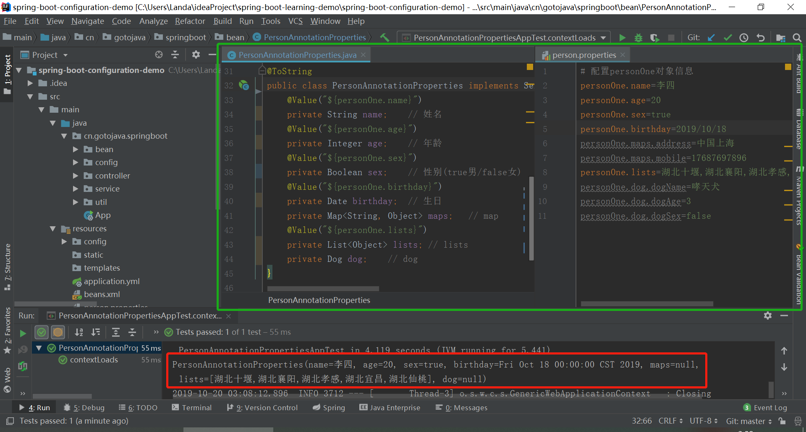
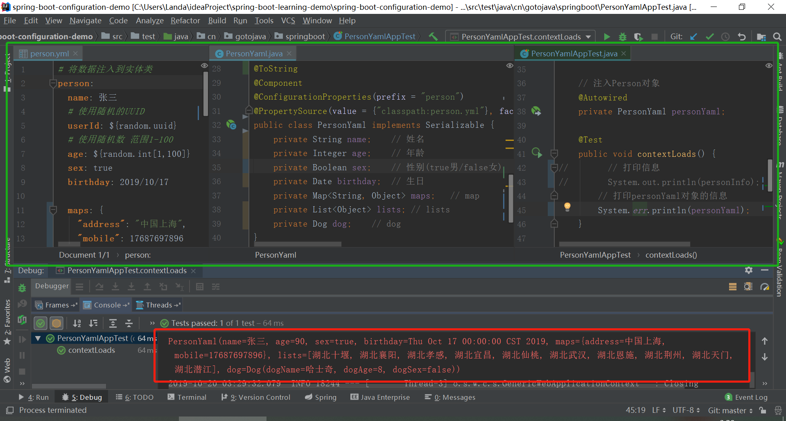
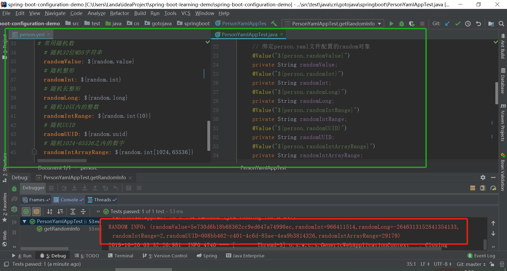
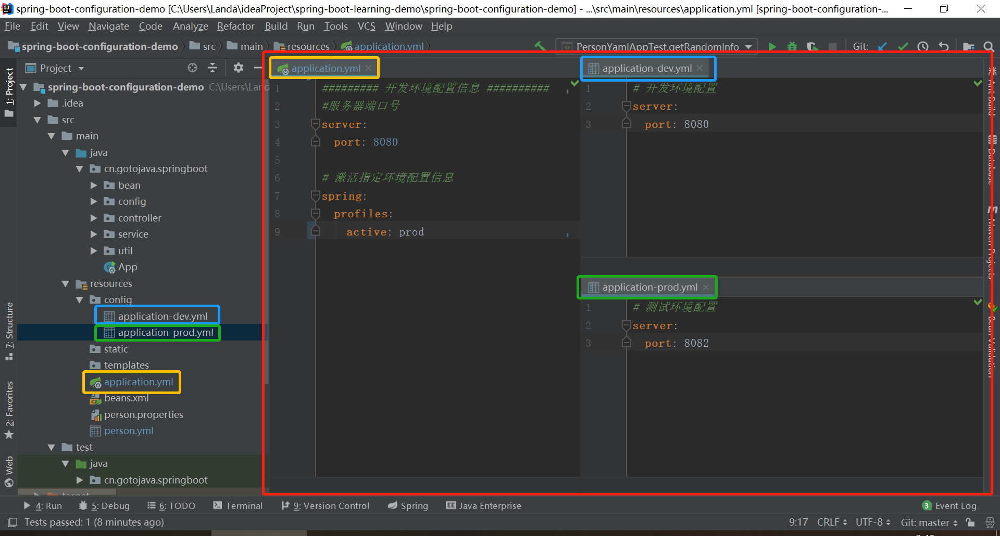
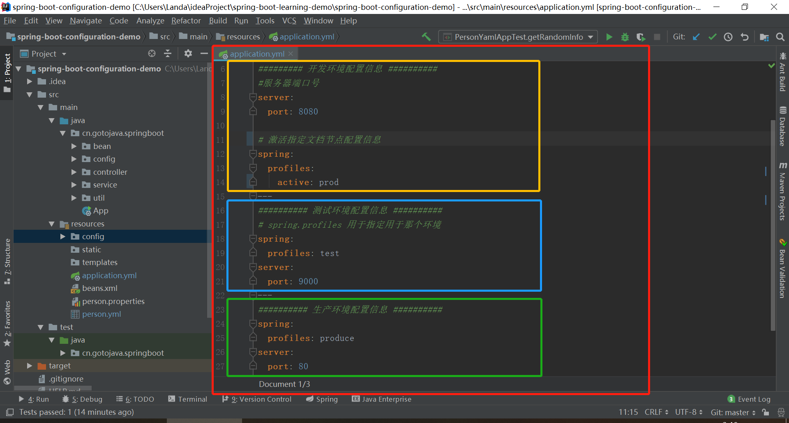

# spring-boot-configuration-demo #

> Spring boot的YAML&Properties配置

> 需求：编写yaml文件和properties文件，将配置文件内容注入到对象中，通过对象获取配置文件信息

## 什么是YAML ##
    **YAML**（“YAML不是标记语言”的递归缩写）是一种人类可读的**数据序列化语言**。它通常用于配置文件和用于存储或传输数据的应用程序。
	--引用自《维基百科》
> yaml示例:

```yaml
server:
  port: 80
person:
  name: 张三
  age: 18
  sex: true
  birthday: 2019/10/17
  maps: {"address": "中国上海", "mobile": 17687697896}
  lists:
  - 湖北十堰
  - 湖北襄阳
  - 湖北孝感
  - 湖北宜昌
  - 湖北仙桃
  - 湖北武汉
  - 湖北恩施
  - 湖北荆州
  - 湖北天门
  - 湖北潜江
  dog:
    dogName: 哈士奇
    dogAge: 8
    dogSex: false
```

YAML语法:[yaml-grammar.md](yaml-grammar.md "YAML语法")

## Spring Boot常用配置文件注解 ##
```
@ConfigurationProperties：把同类的配置信息自动封装成实体类
@Value：将外部的值动态注入到Bean中
@Bean：注册一个Bean，并且交给Spring容器去管理(IOC)
@PropertySource：加载指定配置文件(默认只能用于.properties文件)
@ImportResource：读取外部Spring配置文件,让配置文件中的内容生效
```

- ### @Value和@ConfigurationProperties获取值的区别比较 ###
> @ConfigurationProperties：把同类的配置信息自动封装成实体类
> @Value：将外部的值动态注入到Bean中



```
总结：
只需要获取配置文件中的某项值，则可以使用@Value
如果专门编写了一个JavaBean来和配置文件进行映射，就使用@ConfigurationProperties
```

> 更多请参考**参考文档**`>`@ConfigurationProperties获取值和@Value获取值比较

## 配置文件占位符 ##

- ### 配置文件中可以使用随机数 ###

```yaml
${random.value}	# 随机32位MD5字符串
${random.int}	# 随机整形
${random.long}	# 随机长整形
${random.int(10)}	# 随机10以内的整数
${random.int[1024,65536]}	# 随机1024-65536之内的数字	
${random.uuid}	# 随机UUID
```

- ### 配置文件占位符 ###

```yaml
person:
  name: 张三
  # 使用随机的UUID
  userId: ${random.uuid}
  # 使用随机数
  age: ${random.int[1,100]}
  dog:
    dogName: 哈士奇
    dogId: ${random.uuid}
    dogAge: ${random.int[0,15]}
info: 信息(姓名=${person.name}, 用户ID=${person.userId:null}，年龄=${person.age}, 宠物名称=${person.dog.dogName}，宠物ID=${person.dog.dogId:null}，宠物年龄=${person.dog.dogAge})
```

- 可以在配置文件中引用前面配置过的属性
- ${person.userId:null}：可以用来指定当找不到person.userId属性时，使用:指定默认值，这里指定的默认值为null

## Profile ##
Profile是Spring对**不同环境提供不同配置功能的支持**，可以通过激活、指定参数等方式快速切换环境

- ### 多Profile文件 ###
主配置文件编写的时候，文件名可以是：application-`{profile}`.properties/yml
默认使用application.properties的配置文件，**当通过profile文件配置后，需要通过指定profile来激活指定环境的配置文件**

- ### yml支持多文档块方式 ###

```yaml
######### 开发环境配置信息 ##########
#服务器端口号
server:
  port: 8080

# 激活指定环境配置信息
spring:
  profiles:
    active: produce

---
########## 测试环境配置信息 ##########
spring:
  profiles: test
server:
  port: 9000
---
########## 生产环境配置信息 ##########
spring:
  profiles: produce
server:
  port: 80
```

```text
说明：
---：用于分割文档
spirng.profiles:用于指定配置信息用于的环境名称
spring.profiles.active:用于激活配置文件，参数由spring.profiles定义
```

- ### 激活指定profile ###

	+ #### yml文件激活： ####

	```yaml
	# 激活指定环境配置文件
	spring:
	  profiles:
	    active: dev
	```

	+ #### properties文件激活 ####

	```properties
	spring.profiles.active=dev
	```

## 配置文件的加载位置 ##
Spring boot启动会扫描以下位置的application.properties/application.yml文件作为Spring boot的默认配置文件

1. file:./config/
2. file:./
3. classpath:/config/
4. classpath:/

> 以上按照优先级**从高到低**的顺序，所有位置的文件都会被加载，**高优先级配置内容会覆盖低优先级配置内容**。
> 可以通过配置**spring.config.location**来改变默认配置,需要注意的是通过spring.config.location指定的配置文件会和默认配置位置的配置文件共同生效，形成**互补配置**

## 外部配置加载顺序 ##
Spring Boot也可从以下位置加载配置文件(***按照优先级从高到低，高优先级的配置覆盖低优先级的配置，指定的配置文件会和默认配置位置的配置文件共同生效，形成互补配置***)：
1. **命令行参数**
	```text
	java -jar spring-boot-configuration-demo-0.0.1-SNAPSHOT.jar --server.port=8080
	```
2. 来自java:comp/env的JNDI属性
3. Java系统属性(System.getProperties())
4. 操作系统环境变量
5. RandomValuePropertySource配置的random.*属性值
6. **jar包外部的application-{profile}.properties或application.yml(带spring.profile)配置文件**
7. **jar包内部的application-{profile}.properties或application.yml(带spring.profile)配置文件**
8. **jar包外部的application-properties或application.yml(不带spring.profile)配置文件**
9. **jar包内部的application-properties或application.yml(不带spring.profile)配置文件**
10. @Configuration注解类上的@PropertySource
11. 通过SpringApplication.setDefaultProperties指定的默认属性

(***注意：jar包外部配置文件的加载必须在application.yml/application.properties未指定spring.profiles.active的情况下才有效***)

> 更多详细请参考官方文档：[Spring Boot外部化配置](https://docs.spring.io/spring-boot/docs/1.5.22.RELEASE/reference/html/boot-features-external-config.html "https://docs.spring.io/spring-boot/docs/1.5.22.RELEASE/reference/html/boot-features-external-config.html")

> 常见配置文件属性参考文档：[常见的应用程序属性](https://docs.spring.io/spring-boot/docs/1.5.22.RELEASE/reference/html/common-application-properties.html "https://docs.spring.io/spring-boot/docs/1.5.22.RELEASE/reference/html/common-application-properties.html")

## 自动配置原理 ##
- SpringBoot实战之SpringBoot自动配置原理：[SpringBoot实战之SpringBoot自动配置原理](https://www.cnblogs.com/hhcode520/p/9450933.html "SpringBoot实战之SpringBoot自动配置原理")

- ### @Conditional注解 ###
> 作用：必须是@Conditional指定的条件成立，才给容器中添加组件，配置中的所有内容才生效

|@Conditional注解|作用(判断是否满足当前指定条件)|
|:--------------|:------------------------|
|@ConditionalOnJava|系统的Java版本是否符合要求|
|@ConditionalOnBean|容器中存在指定Bean|
|@ConditionalOnMissingBean|容器中不存在指定Bean|
|@ConditionalOnExpression|满足SpEL表达式指定|
|@ConditionalOnClass|系统中有指定的类|
|@ConditionalOnMissingClass|系统中没有指定的类|
|@ConditionalOnSingleCandidate|容器中只有一个指定的Bean，或者这个Bean是首选Bean|
|@ConditionalOnProperty|系统中指定的属性是否有指定的值|
|@ConditionalOnResource|类路径下是否存在指定资源文件|
|@ConditionalOnWebApplication|当时是Web环境|
|@ConditionalOnNotWebApplication|当前不是Web环境|
|@ConditionalOnJndi|JNDI存在指定项|

- ### 查看Spring Boot启动自动配置报告 ###
1. 在application.yml/application.properties文件中加入如下配置信息
```yaml
# 开启调试模式
debug: true
```

2. 在启动控制台查看Spring Boot自动配置报告

```text
=========================
AUTO-CONFIGURATION REPORT
=========================


Positive matches:	# 自动配置匹配上后启用的自动配置类
-----------------

   DispatcherServletAutoConfiguration matched:
      - @ConditionalOnClass found required class 'org.springframework.web.servlet.DispatcherServlet'; @ConditionalOnMissingClass did not find unwanted class (OnClassCondition)
      - @ConditionalOnWebApplication (required) found 'session' scope (OnWebApplicationCondition)

   DispatcherServletAutoConfiguration.DispatcherServletConfiguration matched:
      - @ConditionalOnClass found required class 'javax.servlet.ServletRegistration'; @ConditionalOnMissingClass did not find unwanted class (OnClassCondition)
      - Default DispatcherServlet did not find dispatcher servlet beans (DispatcherServletAutoConfiguration.DefaultDispatcherServletCondition)

   DispatcherServletAutoConfiguration.DispatcherServletRegistrationConfiguration matched:
      - @ConditionalOnClass found required class 'javax.servlet.ServletRegistration'; @ConditionalOnMissingClass did not find unwanted class (OnClassCondition)
      - DispatcherServlet Registration did not find servlet registration bean (DispatcherServletAutoConfiguration.DispatcherServletRegistrationCondition)

   DispatcherServletAutoConfiguration.DispatcherServletRegistrationConfiguration#dispatcherServletRegistration matched:
      - @ConditionalOnBean (names: dispatcherServlet; types: org.springframework.web.servlet.DispatcherServlet; SearchStrategy: all) found beans 'dispatcherServlet', 'dispatcherServlet' (OnBeanCondition)

   EmbeddedServletContainerAutoConfiguration matched:
      - @ConditionalOnWebApplication (required) found 'session' scope (OnWebApplicationCondition)


Negative matches:	# 没有匹配上的自动配置类，不会启动
-----------------

   ActiveMQAutoConfiguration:
      Did not match:
         - @ConditionalOnClass did not find required classes 'javax.jms.ConnectionFactory', 'org.apache.activemq.ActiveMQConnectionFactory' (OnClassCondition)

   AopAutoConfiguration:
      Did not match:
         - @ConditionalOnClass did not find required classes 'org.aspectj.lang.annotation.Aspect', 'org.aspectj.lang.reflect.Advice' (OnClassCondition)

   ArtemisAutoConfiguration:
      Did not match:
         - @ConditionalOnClass did not find required classes 'javax.jms.ConnectionFactory', 'org.apache.activemq.artemis.jms.client.ActiveMQConnectionFactory' (OnClassCondition)

   BatchAutoConfiguration:
      Did not match:
         - @ConditionalOnClass did not find required classes 'org.springframework.batch.core.launch.JobLauncher', 'org.springframework.jdbc.core.JdbcOperations' (OnClassCondition)

   CacheAutoConfiguration:
      Did not match:
         - @ConditionalOnBean (types: org.springframework.cache.interceptor.CacheAspectSupport; SearchStrategy: all) did not find any beans (OnBeanCondition)
      Matched:
         - @ConditionalOnClass found required class 'org.springframework.cache.CacheManager'; @ConditionalOnMissingClass did not find unwanted class (OnClassCondition)

```

## 效果展示 ##
- ### 项目截图 ###


+ ### 运行截图 ###
	- #### Properties文件注解绑定参数获取 ####
	

	- #### YAML文件注解自动封装获取 ####
	

	- #### YAML文件获取随机数 ####
	

	- #### YAML文件多profile文件环境配置 ####
	

	- #### YAML文件多文档块环境配置 ####
	

## 参考文档 ##
- Spring Boot读取自定义配置文件：[https://cloud.tencent.com/developer/article/1481440](https://cloud.tencent.com/developer/article/1481440 "Spring Boot实战之读取自定义配置文件")
- idea读取properties配置文件时中文乱码：[https://blog.csdn.net/li1325169021/article/details/91985475](https://blog.csdn.net/li1325169021/article/details/91985475 "idea properties读取配置文件中文乱码")
- @ConfigurationProperties获取值和@Value获取值比较：[https://blog.csdn.net/clmmei_123/article/details/81871836](https://blog.csdn.net/clmmei_123/article/details/81871836 "@ConfigurationProperties获取值和@Value获取值比较")
- Spring中Bean的理解以及@Bean的作用：[https://www.cnblogs.com/superslow/p/9113639.html](https://www.cnblogs.com/superslow/p/9113639.html "https://www.cnblogs.com/superslow/p/9113639.html")