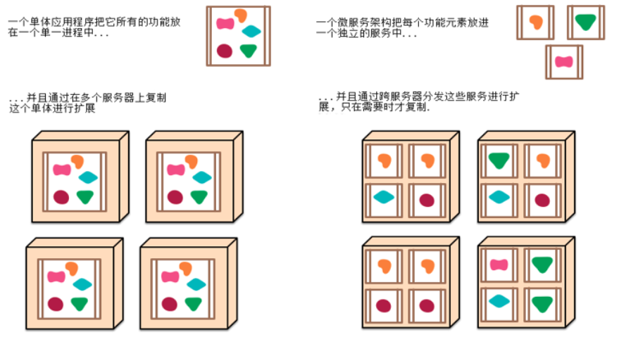

# spring-boot-helloworld #

> Spring boot的启动demo

需求：浏览器发送/hello请求，服务器接受并处理，响应Hello World字符串

## 什么是Spring Boot ##
Spring Boot框架是基于Spring4.0的一个服务框架，Spring Boot用来**简化Spring的应用开发**，遵循约定大于配置的原则，***解决了JAVAEE笨重的开发、繁多的配置、低下的开发效率、复杂的部署流程、第三方技术集成难度大等问题。***

## Spring Boot 优点 ##
- **快速创建独立运行的Spring项目(Spring Initializr)以及与主流的框架做集成**，如SpringBoot + Mybatis/Mybatis-plus、SpringBoot + Spring Cloud + Spring Cloud Data Flow；
- **使用嵌入式的Servlet容器，应用不需要再打成War包，使部署更简单；**
- starter自动依赖于版本控制
- 大量的自动配置，简化开发，可以根据需求修改其默认配置而无需编写和配置繁琐的XML文件，不需要代码生成，开箱即用
- 准生成环境运行时应用监控

## 什么是微服务 ##

- 微服务：[https://github.com/YangZhao5Java/note-navigation/blob/master/src/MicroService.md](https://github.com/YangZhao5Java/note-navigation/blob/master/src/MicroService.md "https://github.com/YangZhao5Java/note-navigation/blob/master/src/MicroService.md")

## 参考文档 ##
- 在idea中创建SpringBoot项目：[https://segmentfault.com/a/1190000015551964](https://segmentfault.com/a/1190000015551964 "https://segmentfault.com/a/1190000015551964")
- 什么是微服务架构？：[https://www.zhihu.com/question/65502802/answer/802678798](https://www.zhihu.com/question/65502802/answer/802678798 "https://www.zhihu.com/question/65502802/answer/802678798")